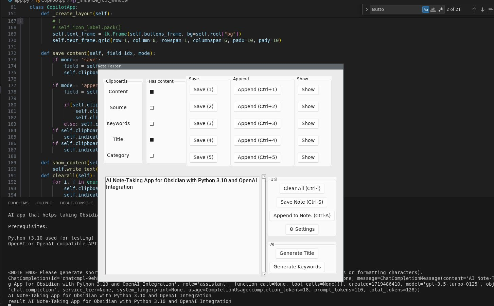

## Note Helper

AI clipboard app that helps taking Obsidian notes.

Prerequisites:
- Python (3.10 used for testing)
- OpenAI or OpenAI compatible API key, or GPU for local LLM inference.

Usage: 
- Copy some text and press ctrl+B to invoke helper window. 

Credits:
- Code & ideas borrowed from @beratcnm https://github.com/beratcnm/local-intelligence

License:
- Apache 2.0 
